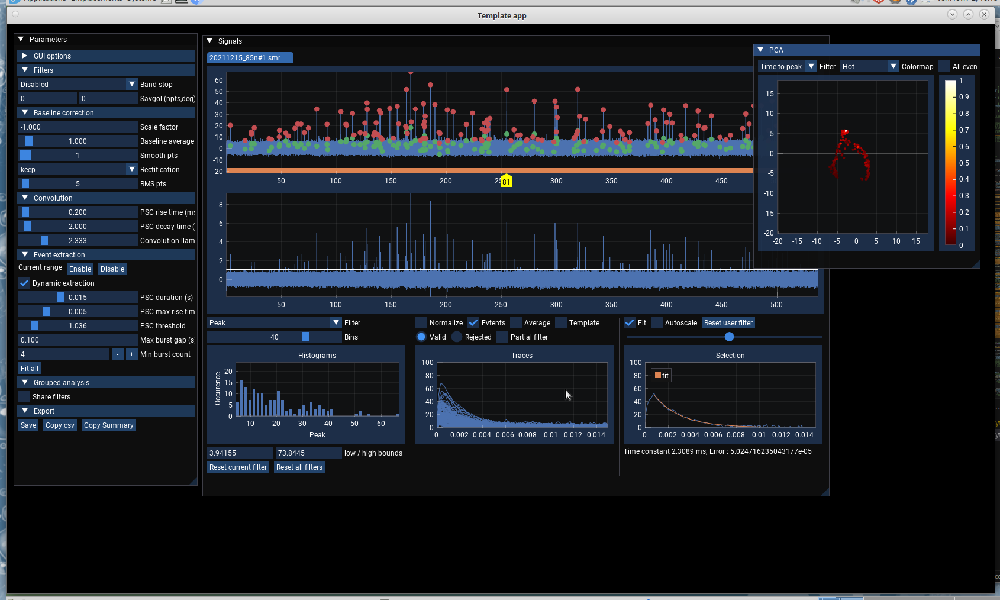

TorchPSC
========
Torchpsc is an experimental tool to perform Post Synaptic Current (PSC) analysis on a GPU (NVIDA only, for now, although it should be possible to use AMD through ROCm cupy interface).  
(c) Yves33

1- Requirements:
================
Torchpsc uses cupy to filter, extract and analyse PSC
+ cuda toolkit (GPU side computations)
+ cupy  (GPU side computations)
+ cusignal (argrelextrema cusignal is not required if cupy>=13)
+ cuML (PCA, UMAP on GPU)
+ numpy (CPU side computations)
+ scipy (curve_fit, iirnotch, filtfilt, savgol_filter)
+ h5py to save the results
+ pypeclip to quickly copy summary
+ python-neo
+ pyOpenGL
+ imgui-bundle

2- Usage and features:
======================
+ The software can accept axon *.abf or spike2 *.smr files. signal units has to be A (or a multiple)
+ Blazing fast display of current traces with detected PSCs
+ Real time rectification/filtering ofinput traces
+ Real time Wiener deconvolution of input signals using user defined template (biexponential)
+ Real time event extraction and feature caracterization
+ Real time measurements of PSC params:
  - Peak
  - Amplitude
  - Time to Peak
  - Half width
  - Area
  - Sharpness (number of crosses at half amplitude)
+ Real time visualisation of events PCA/UMAP
+ Fast PSC exponential decay fitting and residual error calculation
+ Powerfull event filtering mechanism based on extracted parameters
+ Additional manual event filtering
+ Burst detection
+ Cumulative amplitudes and intervals display
+ Save/load results files to hdf stores
+ Random crashes (It's not a feature, It's a bug!!)

3- Limitations and warning:
===========================
+ This software has been tested with fedora38 / cupy 12.8 
+ It should theoretically run with cupy 13 (not working on my machine)
+ It should theoretically work on windows using wsl2 (but not natively)
+ This software is still alpha stage and may crash unexpectedly!

Todo:
=====
+ Write a decent manual
+ Implement machine learning approaches to classify IPSCs/EPSCs (using pytorch, aeon, pyts)
+ Jupyter companion notebook for high quality figure export
+ More input file formats (axographx, etc) through neo-python

